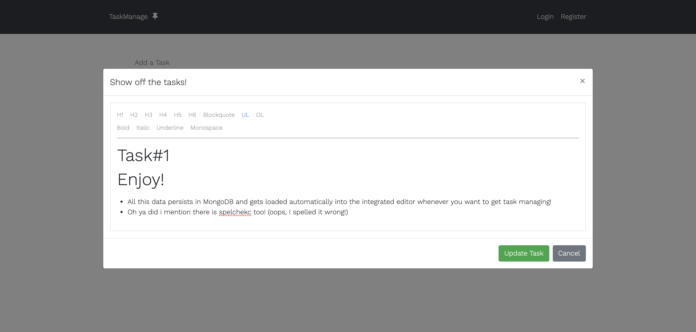

# Task Manager

### About the project

- This is a full-stack productivity task manager application built with the MERN stack.
- The purpose of this application is to allow registered users the ability to layout tasks they plan to accomplish and have them displayer neatly in the UI.
- Upon naming a new task, the user will have the ability to edit the task to change its title but also use a full-fledged rich text editor to add subtasks, notes, lists, etc. such that each task you plan to accomplish can contain all sorts of data about the task! Below is the button you'd press to open up the editor to update said task / add information to it.
- The data is parsed from text in the editor to HTML and saved to the database. Once you load the task up to edit it again, the editor will be automatically populated with your last edit and parsed from the string in the database back into rich text in the same format as its HTML equivalent!
  
  
- After adding notes, a new task name, etc. you can submit your changes and have the application update in real time.
- The application allows you to update your profile information and also track the task queue aside from the task page. Pretty neat!
  

##### Click to see demonsstration on YouTube:

### Project Inspiration

- Ths project was inspired by Traversy Medias MERN stack grocery list tutorial found [here](https://www.youtube.com/playlist?list=PLillGF-RfqbbiTGgA77tGO426V3hRF9iE)
- I took this idea and expanded heavily upon it. Not only did I buld this with modern React modern development (Hooks) I built my own version of the backend and frontend while also adding all the feastures I have explained + plan to add in the 'Further Versions' section
- The lack of a sleek, clean and nicely functioning advanced task management app on the market drove me to develop this. As a student and someone often working on self improvement with side projects and tutorials, I wanted a one-stop-shop for a task manager to layout my tasks and add notes, links, etc. about said tasks in one place without all the extra clutter that other platforms give
