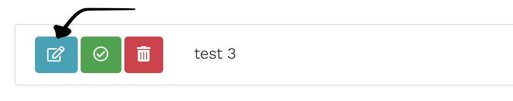

# Task Manager

### About the project

- This is a full-stack productivity task manager application built with the MERN stack.
- The purpose of this application is to allow registered users the ability to layout tasks they plan to accomplish and have them displayer neatly in the UI.
- Upon naming a new task, the user will have the ability to edit the task to change its title but also use a full-fledged rich text editor to add subtasks, notes, lists, etc. such that each task you plan to accomplish can contain all sorts of data about the task! Below is the button you'd press to open up the editor to update said task / add information to it.
  
- After adding notes, a new task name, etc. you can submit your changes and have the application update in real time.
- If you are reading this at the time that the readme shows what the app is "going to have" the ablity to do or "further versions", that means I am actively developing the app and progress will continue to be made!

### Further versions

- After completing the ability to create a task and add all sorts of data about that task, the next iteration of this application is planned to add the following features:

1. Set priorities on a task
2. Sort by priority and drag-to-rearange ability
3. Dark / light mode toggle
4. Upload images to a task
5. Set due dates on a task that will determine tags on a task like "due soon", "due today", "past-due", "urgent", etc.

### Project Inspiration

- Ths project was inspired by Traversy Medias MERN stack grocery list tutorial found [here](https://www.youtube.com/playlist?list=PLillGF-RfqbbiTGgA77tGO426V3hRF9iE)
- I took this idea and expanded heavily upon it. Not only did I buld this with modern React modern development (Hooks) I built my own version of the backend and frontend while also adding all the feastures I have explained + plan to add in the 'Further Versions' section
- The lack of a sleek, clean and nicely functioning advanced task management app on the market drove me to develop this. As a student and someone often working on self improvement with side projects and tutorials, I wanted a one-stop-shop for a task manager to layout my tasks and add notes, links, etc. about said tasks in one place without all the extra clutter that other platforms give
